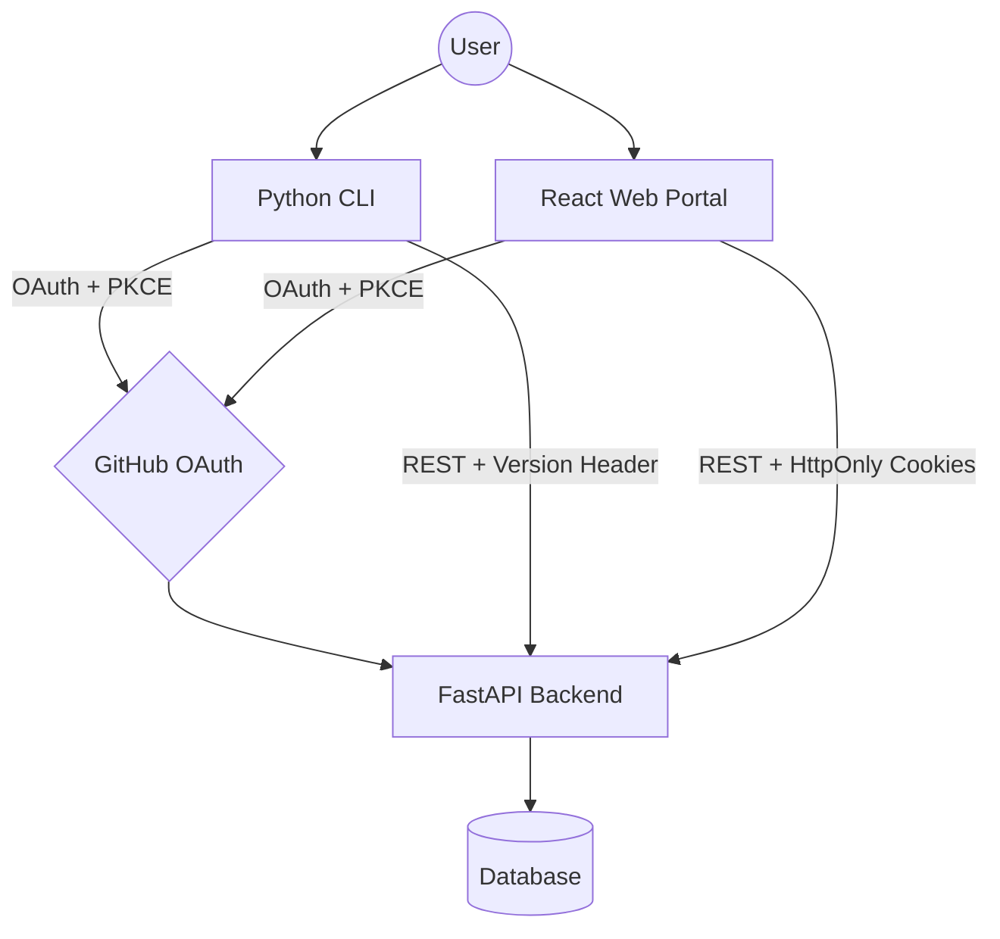

# Insighta Labs+ Intelligence Engine Backend

A queryable demographic intelligence API built with FastAPI and PostgreSQL (Neon).
Clients can filter, sort, paginate, and query profiles using natural language.


---

## Project Features

- **Advanced Filtering** — filter profiles by gender, age group, country, 
  age range, and probability scores
- **Sorting** — sort results by age, created date, or gender probability 
  in ascending or descending order
- **Pagination** — all list endpoints support page and limit parameters
- **Natural Language Search** — query profiles using plain English like 
  "young males from nigeria" or "adult females above 30"
- **Profile Creation** — create new profiles by name using demographic 
  data from Genderize, Agify, and Nationalize APIs
- **2,026 Seeded Profiles** — pre-loaded demographic dataset ready to query


## System Architecture
### System Architecture


Note:*This diagram represents the full Insighta ecosystem. This repository handles the Web portion of the architecture. I tried using <a href="https://mermaid.js.org" target="_blank" rel="noopener noreferrer">mermaid editor</a> to create this*


#### The platform is split into three independent parts:

GitHub OAuth -> FastAPI Backend (Python) -> Client:React Web Portal (this repo) and CLI


- The **backend** handles all auth, data, and business logic
- The **web portal** is a React SPA that talks to the backend via REST
- The **CLI** (separate repo) shares the same backend
- All three interfaces use one source of truth — the same database and API

## Tech Stack

- **FastAPI** — API framework
- **PostgreSQL (Neon)** — Database
- **SQLAlchemy** — ORM
- **uuid6** — UUID v7 generation
- **pycountry** — Country name lookup

---


## Setup & Installation

### 1. Clone the repo
```bash
git clone https://github.com/Chimereya/hng-stage-3.git
cd hng-stage-3
```

### 2. Create and activate virtual environment
```bash
python -m venv env       # For linux, you might want to use 'python3'
source env/bin/activate  # Windows: env\Scripts\activate
```

### 3. Install dependencies
```bash
pip install -r requirements.txt
```

### 4. Configure environment variables
Create a `.env` file in the project root:
Then add the following: 

DATABASE_URL=your_neon_postgresql_connection_string 

GITHUB_CLIENT_ID=your_client_id
GITHUB_CLIENT_SECRET=your_client_secret
GITHUB_REDIRECT_URI=your_callback_uri
# JWT
JWT_SECRET=your_secret_key
JWT_ALGORITHM=jwt_algorithm

# App
FRONTEND_URL=https://your_frontend_url.com

### 5. Seed the database
```bash
python seed.py
```
Re-running the seed script will not create duplicate records(Idempotency).

### 6. Run the server
```bash
uvicorn app.main:app --reload
```

---

## API Endpoints

### `GET /api/profiles`
Fetch profiles with optional filtering, sorting, and pagination.

**Query Parameters:**
| Parameter | Type | Description |
|---|---|---|
| `gender` | string | `male` or `female` |
| `age_group` | string | `child`, `teenager`, `adult`, `senior` |
| `country_id` | string | ISO 2-letter code e.g. `NG`, `KE` |
| `min_age` | integer | Minimum age |
| `max_age` | integer | Maximum age |
| `min_gender_probability` | float | Minimum gender confidence score |
| `min_country_probability` | float | Minimum country confidence score |
| `sort_by` | string | `age`, `created_at`, `gender_probability` |
| `order` | string | `asc` or `desc` (default: `asc`) |
| `page` | integer | Page number (default: `1`) |
| `limit` | integer | Results per page (default: `10`, max: `50`) |

**Example Query:**

GET /api/profiles?gender=male&country_id=NG&min_age=25&sort_by=age&order=desc&page=1&limit=10

**Response:**
```json
{
  "status": "success",
  "page": 1,
  "limit": 10,
  "total": 120,
  "data": [...]
}
```

---

### `GET /api/profiles/search`
Query profiles using plain English natural language.

**Query Parameters:**
| Parameter | Type | Description |
|---|---|---|
| `q` | string | Natural language query |
| `page` | integer | Page number (default: `1`) |
| `limit` | integer | Results per page (default: `10`, max: `50`) |

**Example Query:**

GET /api/profiles/search?q=young males from nigeria
GET /api/profiles/search?q=adult females from kenya
GET /api/profiles/search?q=seniors above 65

**Supported Query Patterns:**
| Query | Parsed As |
|---|---|
| `young males` | gender=male, min_age=16, max_age=24 |
| `females above 30` | gender=female, min_age=30 |
| `people from angola` | country_id=AO |
| `adult males from kenya` | gender=male, age_group=adult, country_id=KE |
| `male and female teenagers above 17` | age_group=teenager, min_age=17 |

**Response:**
```json
{
  "status": "success",
  "page": 1,
  "limit": 10,
  "total": 45,
  "data": [...]
}
```

**Error — uninterpretable query:**
```json
{
  "status": "error",
  "message": "Unable to interpret query"
}
```

---

### `POST /api/profiles`
Create a new profile by fetching demographic data from external APIs.

**Request Body:**
```json
{
  "name": "John Doe"
}
```

**Response:**
```json
{
  "status": "success",
  "data": {
    "id": "...",
    "name": "john doe",
    "gender": "male",
    "gender_probability": 0.95,
    "age": 35,
    "age_group": "adult",
    "country_id": "US",
    "country_name": "United States",
    "country_probability": 0.85,
    "created_at": "2026-04-22T07:00:00Z"
  }
}
```

---

### `GET /api/profiles/{id}`
Fetch a single profile by its UUID.

**Response:**
```json
{
  "status": "success",
  "data": { ... }
}
```

---

### `DELETE /api/profiles/{id}`
Delete a profile by its UUID. Returns `204 No Content`.

---

## Error Responses

All errors follow this structure:
```json
{
  "status": "error",
  "message": "<error message>"
}
```


## Natural Language Query — How It Works

The `/api/profiles/search` endpoint uses **rule-based parsing only** — no AI or LLMs at all.

The parser (`app/parser.py`) works in this order and I tried tabulating so I and other readers won't get confused:

### 1. Gender Detection
Matches whole words only to avoid false matches (something like "female" matching inside "females"):

| Keywords | Maps To |
|---|---|
| `male`, `males`, `man`, `men` | `gender=male` |
| `female`, `females`, `woman`, `women` | `gender=female` |
| both male and female keywords present | no gender filter will be needed anymore |

### 2. Age Group Detection
| Keywords | Maps To |
|---|---|
| `young` | `min_age=16, max_age=24` |
| `child`, `children` | `age_group=child` |
| `teenager`, `teenagers`, `teen`, `teens` | `age_group=teenager` |
| `adult`, `adults` | `age_group=adult` |
| `senior`, `seniors`, `elderly` | `age_group=senior` |

### 3. Age Range Detection
Uses regex to extract numbers from natural phrases:

| Pattern | Maps To |
|---|---|
| `above X`, `over X`, `older than X` | `min_age=X` |
| `below X`, `under X`, `younger than X` | `max_age=X` |
| `between X and Y` | `min_age=X, max_age=Y` |

### 4. Country Detection
Since the nationalize API powering endpoint `POST /api/profiles` only returns a 2-letter ISO country code (`"NG"`), and not country name, I applied python's `pycountry` library to handle country code conversion to country name(e.g.`"Nigeria"`) in the `services.py` and store it in the database when someone creates a profile.

In `parser.py`, `pycountry` does the reverse. It converts country names 
in a query like `"nigeria"` back to `"NG"` for database filtering.

Also a dictionary of country adjectives was added in case of a country adjective like `nigerian`.

1. **Adjectives map** — nationality words like `nigerian` → `NG`, `kenyan` → `KE`
2. **pycountry exact match** — country names like `nigeria` → `NG`, `kenya` → `KE`

Multi-word countries are tried longest-first to avoid partial matches
(for instance: `"south africa"` is matched before `"africa"`).


## The Parser Limitations & Edge Cases
**1. Non-English queries not supported**
The parser only understands English keywords.

**2. No synonym support**
Words like `"guys"`, `"ladies"`, `"boys"`, `"girls"` are not recognized. 
Only the explicitly listed keywords above will work.

**3. No correction for spelling**
Spellings like `"nigerria"`, `"femalle"`, `"teeneger"` will not match anything and will therefore
return `"Unable to interpret query"`.

**4. query like young adults" contradicts itself**
`"young adults"` sets `min_age=16, max_age=24` (from `young`) AND 
`age_group=adult` (from `adults`) at the same time.

**5. There is no context awareness**
Beyond keyword spotting, the parser cannot understand sentence structure and each keyword is matched independently.

**7. Uncommon nationality adjectives was not covered**
Only adjectives explicitly listed in the `ADJECTIVES` dictionary are recognized.


### Supported Query Examples

| Query | Parsed As |
|---|---|
| `young males from nigeria` | `gender=male, min_age=16, max_age=24, country_id=NG` |
| `females above 30` | `gender=female, min_age=30` |
| `people from angola` | `country_id=AO` |
| `adult males from kenya` | `gender=male, age_group=adult, country_id=KE` |
| `male and female teenagers above 17` | `age_group=teenager, min_age=17` |
| `seniors from egypt` | `age_group=senior, country_id=EG` |
| `women under 25` | `gender=female, max_age=25` |
| `men between 30 and 50` | `gender=male, min_age=30, max_age=50` |

---


## Database Schema

| Field | Type | Notes |
|---|---|---|
| `id` | UUID v7 | Primary key |
| `name` | VARCHAR | Unique |
| `gender` | VARCHAR | `male` or `female` |
| `gender_probability` | FLOAT | Confidence score |
| `age` | INT | Exact age |
| `age_group` | VARCHAR | `child`, `teenager`, `adult`, `senior` |
| `country_id` | VARCHAR(2) | ISO code e.g. `NG` |
| `country_name` | VARCHAR | Full country name e.g. `Nigeria` |
| `country_probability` | FLOAT | Confidence score |
| `created_at` | TIMESTAMP | Auto-generated UTC |

---

## Data Seeding

The database is pre-seeded with 2,026 profiles from `seed_profiles.json`.

To re-seed (it is safe to run multiple times — no duplicates created):
```bash
python seed.py
```
