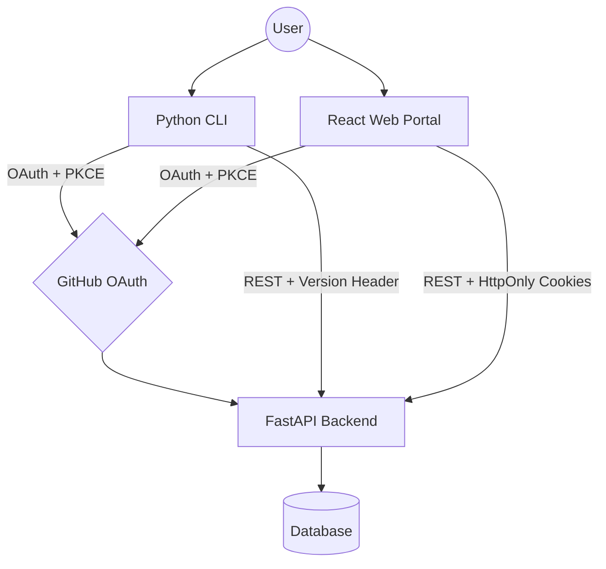

# Insighta Labs+ Intelligence Engine Backend API

A queryable demographic intelligence API built with FastAPI and PostgreSQL (Neon).
Clients can filter, sort, paginate, and query profiles using natural language.
The core API powering the Insighta Labs+ Profile Intelligence Platform.


---

## Live URLs

- **Backend API:**[ [https://hng-stage-3-backend.vercel.app](https://hng-stage-3-backend.vercel.app/)]
- **Web Portal:** [https://insighta-frontend-nu.vercel.app](https://insighta-frontend-nu.vercel.app/)

---

## System Architecture



Note:*This diagram represents the full Insighta ecosystem. This repository handles the Web portion of the architecture. I tried using <a href="https://mermaid.js.org" target="_blank" rel="noopener noreferrer">mermaid editor</a> to create this*


#### The platform is split into three independent parts:

GitHub OAuth -> FastAPI Backend (Python) -> Client:React Web Portal and CLI


- The **backend** handles all auth, data, and business logic
- The **web portal** is a React SPA that talks to the backend via REST
- The **CLI** (separate repo) shares the same backend
- All three interfaces use one source of truth — the same database and API

---


- The **backend** is the single source of truth for all interfaces
- The **web portal** authenticates via HTTP-only cookies
- The **CLI** authenticates via Bearer tokens stored in `~/.insighta/credentials.json`
- All interfaces share the same database and enforce the same rules

---

## Auth Flow

GitHub OAuth with PKCE — works for both web and CLI:

### Web Flow
1. Frontend redirects browser to `GET /auth/github`
2. Backend generates `state`, `code_verifier`, `code_challenge`, saves to `pending_states` table
3. Backend redirects to GitHub OAuth page
4. User authenticates on GitHub
5. GitHub redirects to `GET /auth/github/callback?code=...&state=...`
6. Backend validates state, exchanges code for GitHub token
7. Backend fetches GitHub user info, creates or updates user record
8. Backend issues `access_token` + `refresh_token`, sets them as HTTP-only cookies
9. Browser is redirected to `FRONTEND_URL/dashboard`

### CLI Flow
1. CLI generates its own `state`, `code_verifier`, `code_challenge`
2. CLI opens browser to `GET /auth/github?source=cli&code_challenge=...`
3. After GitHub auth, backend redirects to `http://localhost:8484/callback` with tokens in URL params
4. CLI captures tokens and stores them in `~/.insighta/credentials.json`

---

## Token Handling

| Token | Expiry | Storage (Web) | Storage (CLI) |
|---|---|---|---|
| Access token | 3 minutes | HTTP-only cookie | `credentials.json` |
| Refresh token | 5 minutes | HTTP-only cookie | `credentials.json` |

- Old refresh token is **immediately invalidated** after use
- Each refresh issues a completely new token pair
- Web portal handles refresh automatically via Axios interceptor
- CLI handles refresh automatically before each command

---

## Role Enforcement

| Role | Default | Permissions |
|---|---|---|
| `analyst` | Yes | Read, search, export |
| `admin` | No | Read, search, export, create, delete |

Roles are enforced via FastAPI dependencies:
- `require_analyst` — any authenticated active user
- `require_admin` — authenticated user with `role = admin`
- `get_current_user` — supports both Bearer token (CLI) and HTTP-only cookie (web)

If `is_active = false`, the user receives `403 Forbidden` on all requests.

> **To grant admin access**, update directly in the database:
> ```sql
> UPDATE users SET role = 'admin' WHERE username = 'github-username';
> ```

---

## API Reference

### Auth Endpoints

| Method | Endpoint | Description | Auth |
|---|---|---|---|
| GET | `/auth/github` | Redirect to GitHub OAuth | None |
| GET | `/auth/github/callback` | Handle OAuth callback | None |
| POST | `/auth/refresh` | Refresh access + refresh tokens | Cookie/Body |
| POST | `/auth/logout` | Invalidate refresh token | Cookie |
| GET | `/auth/whoami` | Get current user | Required |

### Profile Endpoints

All profile endpoints require `X-API-Version: 1` header.

| Method | Endpoint | Description | Role |
|---|---|---|---|
| GET | `/api/profiles` | List profiles with filters + pagination | analyst |
| POST | `/api/profiles` | Create a new profile | admin |
| GET | `/api/profiles/search` | Natural language search | analyst |
| GET | `/api/profiles/export?format=csv` | Export profiles as CSV | analyst |
| GET | `/api/profiles/{id}` | Get one profile | analyst |
| DELETE | `/api/profiles/{id}` | Delete a profile | admin |

### Filters (GET /api/profiles)

| Param | Type | Example |
|---|---|---|
| `gender` | string | `male`, `female` |
| `age_group` | string | `child`, `teenager`, `adult`, `senior` |
| `country_id` | string | `NG`, `US` |
| `min_age` | int | `25` |
| `max_age` | int | `40` |
| `sort_by` | string | `age`, `created_at`, `gender_probability` |
| `order` | string | `asc`, `desc` |
| `page` | int | `1` |
| `limit` | int | `10` |

### Pagination Response Shape

```json
{
  "status": "success",
  "page": 1,
  "limit": 10,
  "total": 2026,
  "total_pages": 203,
  "links": {
    "self": "/api/profiles?page=1&limit=10",
    "next": "/api/profiles?page=2&limit=10",
    "prev": null
  },
  "data": []
}
```

---

## Natural Language Search

`GET /api/profiles/search?q=young males from nigeria`

The query is parsed by `app/parser.py` which extracts:

- **Gender** — keywords: `male`, `female`, `men`, `women`, `boys`, `girls`
- **Age group** — keywords: `young`, `adult`, `senior`, `teenager`, `child`
- **Country** — full country names and ISO codes mapped to 2-letter codes

Extracted filters are applied to the database query identically to the standard filter endpoint.

---

## Rate Limiting

| Scope | Limit |
|---|---|
| `/auth/*` endpoints | 10 requests / minute |
| All other endpoints | 60 requests / minute per user |

Returns `429 Too Many Requests` when exceeded.

---

## Logging

Every request logs:
- Method
- Endpoint
- Status code
- Response time (ms)

---

## Project Structure

```
app/
├── main.py              # App entry point, middleware, CORS
├── limiter.py           # Rate limiter instance
├── database.py          # DB connection
├── models.py            # SQLAlchemy models
├── schemas.py           # Pydantic schemas
├── auth.py              # JWT token creation and verification
├── oauth.py             # GitHub OAuth helpers
├── dependencies.py      # FastAPI dependencies (auth, roles)
├── parser.py            # Natural language query parser
├── services.py          # External API calls (genderize, agify, nationalize)
└── routers/
    ├── auth.py          # Auth routes
    └── profiles.py      # Profile routes
```

---

## Local Development

```bash
# Clone the repo
git clone https://github.com/Chimereya/hng-stage-3-backend.git
cd hng-stage-3-backend

# Create virtual environment
python -m venv env
source env/bin/activate  # Windows: env\Scripts\activate

# Install dependencies
pip install -r requirements.txt

# Set up environment variables
cp .env.example .env
# Fill in your values in .env

# Run database migrations
alembic upgrade head

# Start the server
uvicorn app.main:app --reload
```

---

## Environment Variables

```env
DATABASE_URL=postgresql://...
SECRET_KEY=your-secret-key
GITHUB_CLIENT_ID=your-github-client-id
GITHUB_CLIENT_SECRET=your-github-client-secret
FRONTEND_URL=http://localhost:5173
```

---

## Tech Stack

- Python 3.12
- FastAPI
- PostgreSQL (Neon)
- SQLAlchemy
- Alembic
- SlowAPI (rate limiting)
- PyJWT
- httpx
